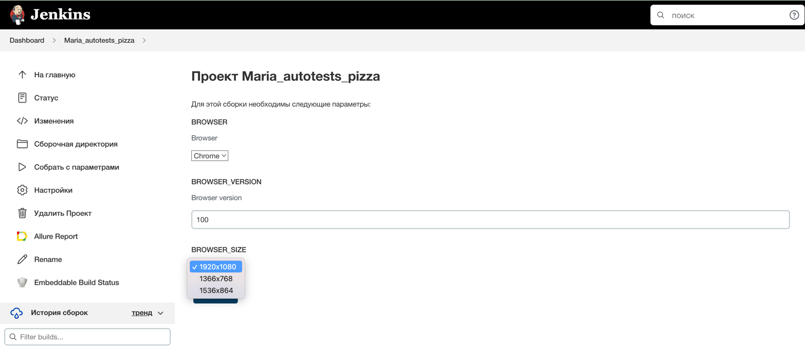

# Проект по автоматизации UI тестирования сайта Додо Пицца
## :pizza: <a target="_blank" href="https://dodopizza.ru/">Сайт Додо Пицца</a>
<a target="_blank" href="https://dodopizza.ru/"></a>

## :page_with_curl: Содержание:

- <a href="#computer-технологический-стек">Технологический стек</a>
- <a href="#clipboard-реализованные-проверки">Реализованные проверки</a>
- <a href="#arrow_forward-запуск-тестов-из-терминала">Запуск тестов из терминала</a>
- <a href="#robot-запуск-тестов-в-jenkins">Запуск тестов в Jenkins</a>
- <a href="#bar_chart-allure-отчет">Allure отчет</a>
- <a href="#incoming_envelope-уведомления-в-telegram">Уведомления в Telegram</a>

## :computer: Технологический стек
<p align="center">


</p>

> Автотесты написаны на <code>Java</code>. 
> Для автоматизированной сборки проекта используется <code>Gradle</code>.
> В качестве библиотеки для тестирования используется <code>JUnit 5</code>.
> В UI-тестах используется <code>Selenide</code>.
> Для подготовки некоторых тестовых данных выполняются запросы к API, написанные с помощью <code>REST-assured</code>.
> Отчеты о тестировании формирует <code>Allure Report</code>.
> Тесты можно запускать в <code>Jenkins</code>.
> Запуск тестов на удаленном браузере выполняется с помощью<code>Selenoid</code>.
> После завершения прогона отправляются уведомления с помощью бота в <code>Telegram</code>.


## :clipboard: Реализованные проверки
- Главная страница:
  - Открытие главной страницы Додо в Санкт-Петебурге по ссылке https://dodopizza.ru/peterburg
  - Переход к разделам меню (несколько тестов с параметрами)
  - Переход к разным разделам несколько раз подряд
  - Отображение на главной странице количества продуктов в корзине (несколько тестов с параметрами)
- Карточка с информацией о пицце:
  - Открытие карточки с информацией при клике по названию пиццы
  - Добавление пиццы в корзину
  - Изменение параметров пиццы:
    - Изменение размера пиццы (несколько тестов с параметрами)
    - Изменение вида теста (несколько тестов с параметрами)
    - Изменение и размера, и теста
    - Изменение размера несколько раз подряд
    - Изменение теста несколько раз подряд


## :arrow_forward: Запуск тестов из терминала
Локальный запуск:
```
gradle clean test
```
Удаленный запуск:
```
gradle clean test -Dremote=true
```
С параметрами:
```
gradle
clean
test
-Dremote=true
-Duser=${REMOTE_DRIVER_USER}
-Dpassword=${REMOTE_DRIVER_PASSWORD}
-DremoteUrl=${REMOTE_DRIVER_URL}
-DbaseUrl=https://dodopizza.ru
-Dbrowser=${BROWSER}
-DbrowserVersion=${BROWSER_VERSION}
-DbrowserSize=${BROWSER_SIZE}
```
По умолчанию параметры такие:
```
remote=false
baseUrl=https://dodopizza.ru
browser=chrome
browserVersion=100
browserSize=1920x1080
```

## :robot: Запуск тестов в Jenkins
<a target="_blank" href="https://jenkins.autotests.cloud/job/Maria_autotests_pizza/">Сборка с параметрами в Jenkins</a>
<p align="center">

</p>

## :bar_chart: Allure отчет
После прогона тестов строится отчет:
- Главная страница отчета
<p align="center">

</p>

- Страница с тестами
<p align="center">

</p>

## :incoming_envelope: Уведомления в Telegram
После завершения сборки Telegram-бот отправляет сообщение с отчетом о прогоне:
<p align="center">

</p>
